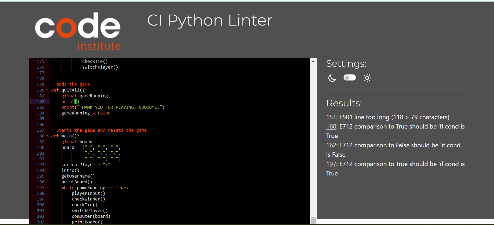
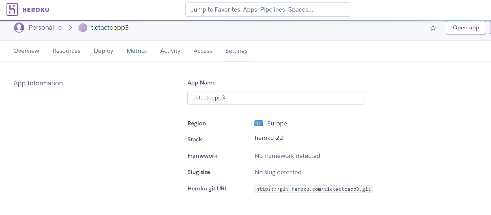

# Tic Tac Toe game
 *This is a tic tac toe game created for educational purposes.
 Code Institute portpholio project 3 

 

 Tic Tac Toe is an age old game that is played around the world. it can be playen on a game board, a paper and pen board, in a sand and rocks board and online in the computer. It is played by two people at a time. One player takes O and another X. The players take turn by turn to mark the space in the 3×3 grid. If the current player marks three of their marks diagonally, horizontally and vertically in a row or a column that player is declared the winner.
  
 The deployed website can be viewed here. [Tic Tac Toe](https://tictactoepp3.herokuapp.com/).

# Table of contents
 - [Tic Tac Toe game](#Tic-Tac-Toe-game)
 - [Table of contents](#Table-of-contents)
 - [Project Goals](#Project-Goals)
 - [Flowchart](#Flowchart)
 - [Technologies](#Technologies)
 - [Existing features](#Existing-Features)
 - [future features](#Future-Features)
 - [Testing](#Testing)
 - [Bugs and solutions](#Project-Bugs-and-Solutions)
 - [deployment](#Deployment)
 - [credits](#Credits)

## Project Goals

 ### User Goals
 - user wants to Know the rules of the game before they start playing
 - user wants to Play the traditional classic tic tac toe online at ease
 - user wants to be able to play reapetdily if they wanted to and to restart the game.
 - user wants to get notified if they won.
 - user wants to play a logical game that is error free.
 - user wants to know the various ways in which they can win the game.

 ### Owner Goals
 - owner wants to create a game that is fun and and engaging to play
 - owner wants a lot of users to visit page
 - owner wants users to understand the rules of tic tac toe before users play
 - owner wants users to be aware of the diffrent ways they can win.
 - owner wants users to know the diffrent spots/marks and the numbers that conside with them
 - owner wants users to know when they entered an invalid input 
 - owner wants users to know that game cant continue unless correct input is entered
 - owner wants users to play the game, have fun and share the game with family and friends

## Flowchart
  
 
## Technologies

 ### Programing languages
 * Python

 ### The technologies and tools
 * Heroku for deploying and hosting. [see here](https://heroku.com/)
 * GitHub and gitpod for Cl and storage. [see here](https://github.com/)
 * App.diagrams for creating the flowchart. [see here](https://app.diagrams.net/)
 * Am i responsive to check responsivity across platforms. [see here](https://amiresponsive.co.uk/).
 * pep8 linter to check code for errors. [see here](https://pep8ci.herokuapp.com/) 

 ### Libraries
 * Random was used so that the computer can generate a random number.

## Existing Features 

 #### Introduction to game
  - As soon as the game is loaded or refreshed, the introduction to the game is shown. A welcome   message is shown as well as rules to the game. 
  

 #### Game begins
  - After the welcome introduction a prompt message is shown for user to enter name. The game cannot begin whithout entering the name. Thereafter the Tic Tac Toe game board is displayed for the player to see the positions and places. after which another prompt message apears for player input. player has to enter an imput coressponding to the position they want from 1 to 9. If anything other than 1 to 9 is selcted or if spot is taken than game wont continue. 
 

 #### Game ends in tie
  - game ends in a tie if none of the 8 winning arangments are alighned or match. In such occation the player recieves a notification that game is over and endded on tie. Player is then given 2 options; to play the game again or to end the game. 
  

 #### Game ends in either player winning 
  - The game will continue with the 2 players taking turns untill any of the 8 winning arragments are matched horizentally, vertically or diagnaly. In such occation the player recieves a notification that game is over and they won or player "o" won. Player is then given 2 options; to play the game again or to end the game. 
  
 
 #### Play again or end the game
  - In the end the player is given two options to end the game or to keep playing. if they choose to play again, the game loads again from the begining. If they however choose to quit then player gets a good by massege. 
  

## Testing

 ### Manual Testing
  #### internal linter
   - Used internal pep8 linter
   * After hearing that pep8 online website was down, i followed the sterps for installing the internal pep8 linter for CI. At first there were so many errors, mainly to do with commenting spaces, whitespace, line too long, blank lines amongst others.
  

  #### Before pep8 linter
  - used Code Institute pep8 linter
  * After i got news that Code Institute made a new pep8 linter, i used it to check and correct any further errors. 
  

  #### Final pep8 linter
  - After corrections
  * In the end there was one final error on line 194. Which states that comparison to True should be if cond is true. I have tried diffrent ways of correcting this line. And used an if condition but unfortunaly game flow doesnt continue. So for that reason I have decided to leave this error as i believe that a (while loop) is suitable here and keep the game in a loop. Am sure there are ways this can be solved but unfortunatly there is not enough time for it now. It is also worth noting that this error does not effect the game in any negative way. 
  
  

## Future Features
  * Add colours and style to make game engaging
  * style game in a way that doesnt need a number input but rather a screen click
  * give player a choice of being player o or player x
  * keep score of the game. This was very easy to implement but saw no big benfit as players will most likly refresh the game.   
  * make the numbers the computer generates randomly be more intuitive and smarter so game can be more engaging.

## Project Bugs and Solutions:
 
 1. Tried to display/print game board with python list and then use a for loop to diplay board. 
 - solution: unfortunaly the board was printing vertically and not horizantally in a 3 by 3 line. So i decided to use another way.

 2.  Number input wasnt catching invalid entries. 
 - solution: I had to come up with a way to validate input errors including wrong numbers, strings, keyboard errors and everything else, my mentor pointed me in the right direction. A try and except block was used to correct errors. This video explained very well how to use try and exept block.
 [see here](https://www.youtube.com/watch?v=u0402sx05yI&t=546s)

 3.  Tried using player input outside varible. but coudnt.
 - solution:  found solution from stackoverflow to redefine the varible using global.

 4.  when played, game was not folllowing through logic. like announced if player o won. or anounces if tie and end game. 
 - tried several solutions. fixed with help from tutors by trying to re- Arrange the (main) function loop.
 

 5. when press 2 to quit game, game was not quiting, tried making a function called quit all that sets gameplaying to false. unfortunaly that didnt help at all. 
 - i tried so many solutions and playd arround with code stubburly for hours. In the end i googled and found the solution was so simple all along. a build in function called quit() can be used or another called exit() amongst other solutions. i was gobsmacked but super happy
 

 6. check tie wasnt working and was ending the game after tie straight away. 
 - solution: fixed it by removing additional winner argument. re arranging functions and by using the playAgainOrNot function inside the check tie function.
 

 7. persistant error of when player chooses to play gaian, current player becomes "o". when it 
 shoud've been "x". 
 - solution: fixed this persistant error by re defining current player on both main function and play again or not function and setting current player to "x".

## Deployment

 ### Heroku
 1. Login to heroku and click new app. Enter app name, try another name if name is taken. Make sure to tick the correct region.
 
 2. After app is created, go to setting from dashboard.
 
 3. In the setting enter convic vars, as i had no json files to hide, i used port and 8000 keys as recomended by code institute. Also add buildbacks python and nodejs in that order.
 
 4. After go to deploy and use github deployment method. log in to git hub via heroku.
 
 5. Choose manual deployment and enable automatic deployment from main branch
 

## Credits 

### printing board and checking for tie
  * I used this toturial to understand general concept and flow of the game as well as how to print game board, how to check for tie and how to print user input on the board.
  [see here](https://www.youtube.com/watch?v=dK6gJw4-NCo&t=23s)

 ### winning arrangments and checking for winnning
 * i used this website to understand the logic of the game and the winning arangements;
 [see here](https://geekflare.com/tic-tac-toe-python-code/)
 

 ### handling input errors
 * I used this video to understand try and catch statment block:
 [see here](https://www.youtube.com/watch?v=u0402sx05yI&t=546s)

 ### ending the game
  * one of the hardest thing that took me days to figure out was finding how to end the game after win or tie. after days of searching I found a simple solution using this blog:
  [see here](https://iq.opengenus.org/terminate-program-in-python/)
  

 
 ### Acknowledgements

 -	To the Code Institute for the course material, lectures and their grounded guidlines for the project.  
 -	To the Slack community for being so helpful, informative and inspiring
 - To [W3schools](https://www.w3schools.com/) and [Stack overflow ](https://stackoverflow.com/) for general reference regarding sytax, tags, elements and everything in between.
 - for GeegFlare for helping with the understanding of the winning game logic.
 - To opengenus.org for making me understand that there are many ways of ending game.
 - To code Coach for his simple method of printing game to board.
 - To my mentor Brian Bohare for supporting me, encouraging me and pointing me to the right direction whenever i was lost.

